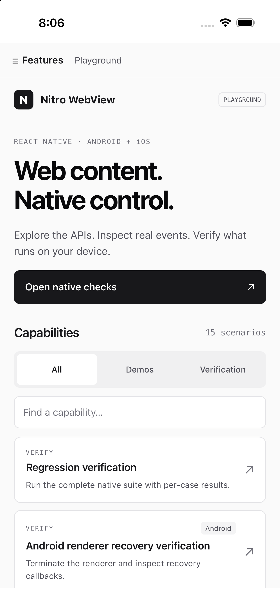
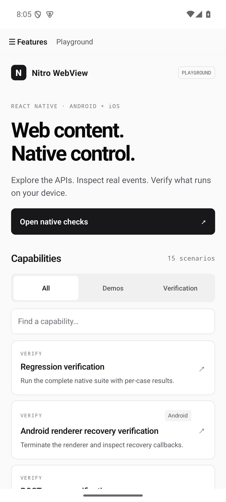
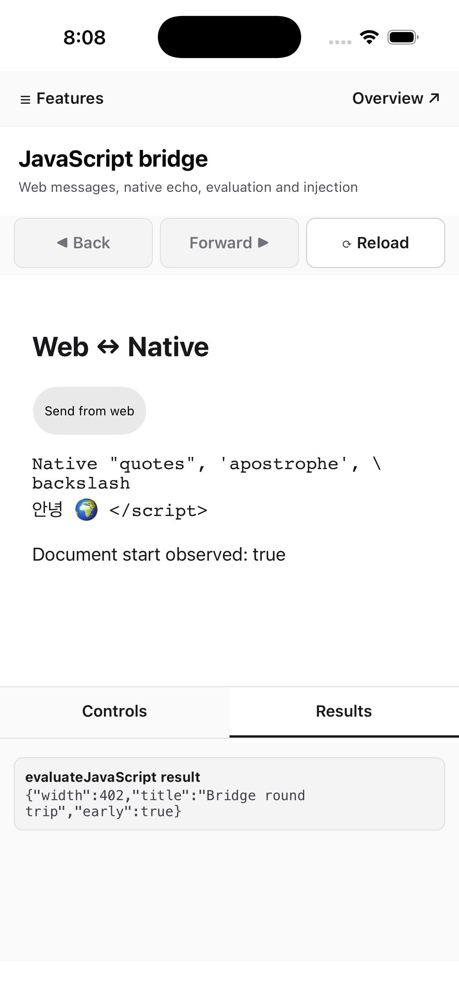
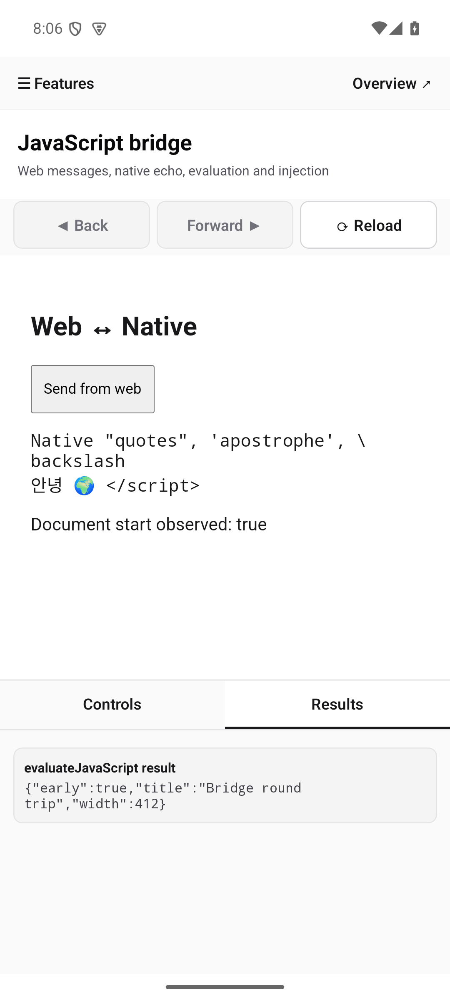

<p align="center">
  
</p>

<h1 align="center">Nitro WebView</h1>

<p align="center">A React Native WebView powered by Nitro Modules.</p>

<p align="center">
  <a href="https://www.npmjs.com/package/nitro-webview"></a>
  <a href="https://www.npmjs.com/package/nitro-webview"></a>
  <a href="LICENSE"></a>
</p>

<p align="center">
  <a href="https://l2hyunwoo.github.io/nitro-webview/"><b>Documentation</b></a> ·
  <a href="https://l2hyunwoo.github.io/nitro-webview/ko/">한국어 문서</a> ·
  <a href="https://l2hyunwoo.github.io/nitro-webview/reference/props.html">API reference</a> ·
  <a href="#quick-start">Quick start</a>
</p>

<table align="center">
  <tr>
    <th width="25%">iOS · Playground</th>
    <th width="25%">Android · Playground</th>
    <th width="25%">iOS · JavaScript bridge</th>
    <th width="25%">Android · JavaScript bridge</th>
  </tr>
  <tr>
    <td align="center"></td>
    <td align="center"></td>
    <td align="center"></td>
    <td align="center"></td>
  </tr>
</table>

<p align="center"><sub>Captured from the iOS and Android Release playground apps.</sub></p>

Embed web content in iOS and Android React Native apps with [Nitro Modules][nitro]. Native views are written in Swift and Kotlin, with props and events dispatched through JSI.

## Features

- Load web pages or render HTML with typed props, methods, and events.
- Exchange messages between your app and the page.
- Inject JavaScript on page loads or evaluate scripts and read their results.
- Control navigation and manage cookies from React Native.

See [platform support](https://l2hyunwoo.github.io/nitro-webview/reference/platforms.html) for differences between iOS and Android.

## Quick start

Requires React Native's **New Architecture**. Check the [installation requirements](https://l2hyunwoo.github.io/nitro-webview/start/installation.html) for compatible React Native, React, and Nitro Modules versions.

```sh
yarn add nitro-webview react-native-nitro-modules
cd ios && pod install
```

`react-native-nitro-modules` is a required peer dependency. Rebuild your native app after installation.

```tsx
import { NitroWebView, callback } from 'nitro-webview'

export default function Screen() {
  return (
    <NitroWebView
      style={{ flex: 1 }}
      source={{ uri: 'https://example.com' }}
      onLoadEnd={callback(() => console.log('loaded'))}
    />
  )
}
```

Every event prop must be wrapped in `callback(...)` so Nitro can dispatch it on the right thread. Passing a raw function will throw at render time.

## Documentation

- [Quick start and hybrid refs](https://l2hyunwoo.github.io/nitro-webview/start/quick-start.html)
- [Props](https://l2hyunwoo.github.io/nitro-webview/reference/props.html), [methods](https://l2hyunwoo.github.io/nitro-webview/reference/methods.html), and [events](https://l2hyunwoo.github.io/nitro-webview/reference/events.html)
- [Platform support](https://l2hyunwoo.github.io/nitro-webview/reference/platforms.html), [permissions](https://l2hyunwoo.github.io/nitro-webview/guides/permissions.html), and [downloads and uploads](https://l2hyunwoo.github.io/nitro-webview/guides/downloads.html)
- [Migration from react-native-webview or 0.1](https://l2hyunwoo.github.io/nitro-webview/guides/migration.html)

## Development

See the [example app and native regression checks](example/README.md) and [documentation site workflow](website/README.md).

## License

[MIT](LICENSE).

[nitro]: https://github.com/mrousavy/nitro
